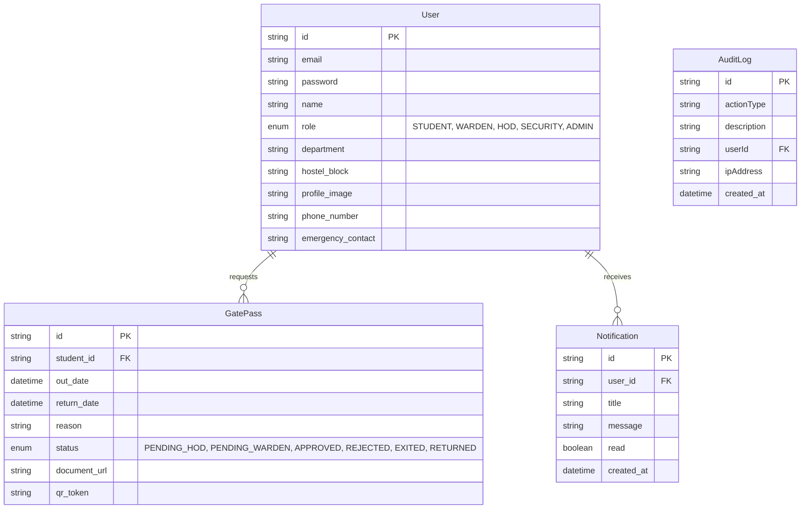
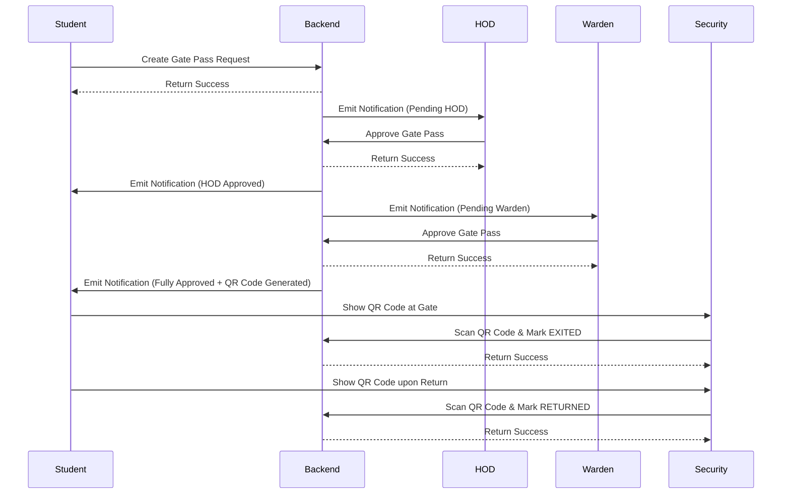

# Smart Warden - Architecture & Documentation

## Overview
Smart Warden is a comprehensive full-stack application designed to digitize the hostel gate pass workflow. It features a robust multi-role architecture, real-time notifications, and strict data validation to ensure secure and efficient gate pass management.

## System Architecture

### Frontend (Client)
- **Framework:** React 19 + Vite
- **Styling:** Tailwind CSS + Framer Motion for micro-animations
- **State Management:** Zustand (Auth, Notifications, Toast)
- **Routing:** React Router v7
- **Validation:** React Hook Form + Zod
- **Real-time:** Socket.io-client

### Backend (Server)
- **Runtime:** Node.js
- **Framework:** Express.js
- **ORM:** Prisma
- **Database:** MySQL (Railway Free Tier)
- **Authentication:** JWT (JSON Web Tokens) + bcryptjs
- **Real-time:** Socket.io
- **Cloud Storage:** Cloudinary (for profile pictures and gate pass documents)

### Deployment Architecture
- **Frontend Hosting:** Vercel (Free Tier)
- **Backend Hosting:** Render (Free Tier)
- **Database Hosting:** Railway MySQL (Free Tier)

---

## Entity Relationship Diagram (ERD)

---

## Workflow Diagram (Gate Pass Request)

---

## Core API Endpoints

### Auth / Profile
- `POST /api/auth/register` - Register a new user
- `POST /api/auth/login` - Authenticate and receive JWT
- `GET /api/auth/me` - Get current user profile
- `PUT /api/auth/profile` - Update phone/emergency contact
- `PUT /api/auth/profile-picture` - Upload profile picture (Cloudinary)
- `PUT /api/auth/password` - Change password

### Gate Pass
- `POST /api/gatepass` - Create a new pass request (Student)
- `GET /api/gatepass` - Get passes (Filtered by role)
- `PATCH /api/gatepass/:id/status` - Update status (HOD, Warden, Security)

### Notifications
- `GET /api/auth/notifications` - Get all notifications for current user
- `PATCH /api/auth/notifications/:id/read` - Mark single notification as read
- `PATCH /api/auth/notifications/read-all` - Mark all notifications as read

### Admin
- `GET /api/admin/analytics` - Fetch system usage analytics
- `GET /api/admin/audit-logs` - Fetch audit logs
- `GET /api/admin/departments` - Manage departments
- `GET /api/admin/hostels` - Manage hostel blocks

### Password Recovery
- `POST /api/recovery/forgot-password` - Request reset link
- `POST /api/recovery/reset-password/:token` - Reset password
